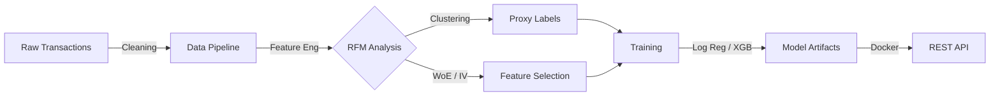


# 💳 Credit Risk Probability Model (RFM-based)

    

> **"Turning Behavior into Creditworthiness"** - A production-grade Machine Learning pipeline for the unbanked.

---

## 📑 Table of Contents
*   [Executive Summary](#-executive-summary)
*   [Credit Scoring Business Understanding](#-credit-scoring-business-understanding)
*   [Methodological Approach](#-methodological-approach)
*   [Project Structure](#-project-structure)
*   [Installation & Usage](#-installation--usage)
*   [API Documentation](#-api-documentation)
*   [Visualizations](#-data-visualization)
*   [License](#-license)

---

## Executive Summary

This repository hosts an end-to-end **Machine Learning System** designed to estimate credit risk for Buy-Now-Pay-Later (BNPL) services. By analyzing transactional *Recency, Frequency, and Monetary (RFM)* patterns, we construct a data-driven proxy for creditworthiness, enabling financial inclusion for users without traditional credit histories.

**Key Capabilities:**
*   **Automatic Feature Engineering**: Extracts temporal profiles and aggregates user stats.
*   **Unsupervised Labeling**: Uses K-Means to identify high-risk cohorts.
*   **Explainable AI**: Deploys Logistic Regression (for auditors) and Gradient Boosting (for performance).
*   **Production Ready**: Dockerized REST API with Pydantic validation.

---

## 💼 Credit Scoring Business Understanding

### Basel II Capital Accord Alignment
This project strictly adheres to the **Basel II Internal Ratings-Based (IRB)** approach. We ensure:
*   **Transparency**: No "black box" magic; inputs are clear behavioral metrics.
*   **Auditability**: Every scoring decision is logged and reproducible.

### The Proxy Target Strategy
**Problem**: How do you train a model without historic default labels (The Cold Start Problem)?
**Solution**: We hypothesize that *behavior predicts risk*.
> "A customer who transacts frequently and consistently (High F, Low R) is likely to repay."

We mathematically formalize this using **RFM Analysis** and unsupervised clustering to generate our ground truth.

### Model Trade-offs
We balance **Regulatory Compliance** with **Predictive Power**:
*   **Logistic Regression**: Preferred for its perfect explainability (Scorecards).
*   **Gradient Boosting**: Used for challenger models to capture non-linear risk factors.

---

## 🔬 Methodological Approach



1.  **Ingest**: Load raw CSV logs.
2.  **Process**: Clean nulls, extract temporal features (Hour/Day), compute RFM stats.
3.  **Label**: Cluster users into `Good` vs `Bad` risk buckets.
4.  **Train**: Fit models using `scikit-learn` pipelines.
5.  **Evaluate**: Track Accuracy, Precision, Recall, and AUC via **MLflow**.
6.  **Serve**: Expose predictions via **FastAPI**.

---

## 📂 Project Structure

```bash
.
├── api/                    #  The REST API
│   ├── main.py             # FastAPI App
│   └── schemas.py          # Pydantic Models
├── data/                   # 💾 Data Lake
│   ├── raw/                # Original Transaction Logs
│   └── processed/          # Cleaned & Featurized Parquet/CSV
├── docker/                 # 🐳 DevOps Configs
│   ├── Dockerfile          # Container Definition
│   └── docker-compose.yml  # Orchestration
├── src/                    # 🧠 The Brains
│   ├── data_processing.py  # Pipeline Orchestrator
│   ├── features.py         # RFM & WoE Calculations
│   ├── train.py            # Training & MLflow Logging
│   ├── predict.py          # Inference Engine
│   └── utils.py            # Helpers
├── tests/                  # 🛡️ Quality Assurance
│   └── test_data_processing.py
└── final_report.md         # 📝 The Detailed Report
```

---

## 💻 Installation & Usage

### Option A: The Docker Way (Recommended)
**Run the full stack in one command:**
```bash
docker-compose -f docker/docker-compose.yml up --build
```
> The API will be live at `http://localhost:8000/docs`

### Option B: The Local Way
1.  **Clone & Install**
    ```bash
    git clone https://github.com/Miftah-Ebrahim/credit-risk-rfm-model.git
    pip install -r requirements.txt
    ```
2.  **Run Pipeline**
    ```bash
    python src/data_processing.py
    ```
3.  **Train Model**
    ```bash
    python src/train.py
    ```
4.  **Start API**
    ```bash
    uvicorn api.main:app --reload
    ```

---

## 🔌 API Documentation

Our API is strictly typed. Send a POST request to `/predict`:

**Input:**
```json
{
  "Recency": 10,
  "Frequency": 5,
  "Monetary_Total": 1500.0,
  "Monetary_Mean": 300.0,
  "Monetary_Std": 50.0
}
```

**Output:**
```json
{
  "risk_probability": 0.04,
  "is_high_risk": false,
  "status": "success"
}
```

---

## 📊 Data Visualization

Detailed EDA is available in `notebooks/eda.ipynb`.
*   [Daily Transaction Volume](dashboard/daily_transaction_volume.png)
*   [Fraud Distribution](dashboard/fraud_distribution_summary.png)
*   [Correlation Matrix](dashboard/feature_correlation_matrix.png)

---

## ⚖️ License

Distributed under the MIT License. See `LICENSE` for more information.

---

<p align="center">
  <b>Built by Miftah collab  with  AI❤️ future Agentic AI Engineer</b><br>
  <i>Validating trust through code.</i>
</p>


