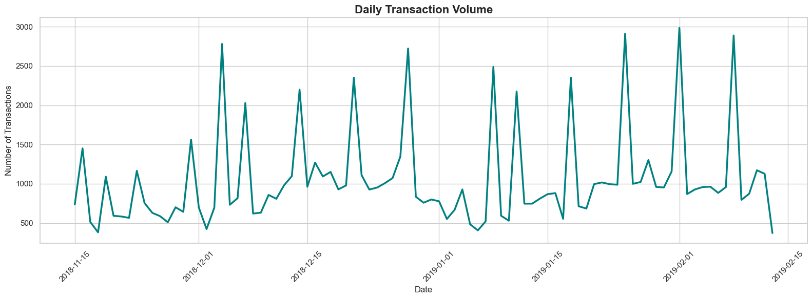
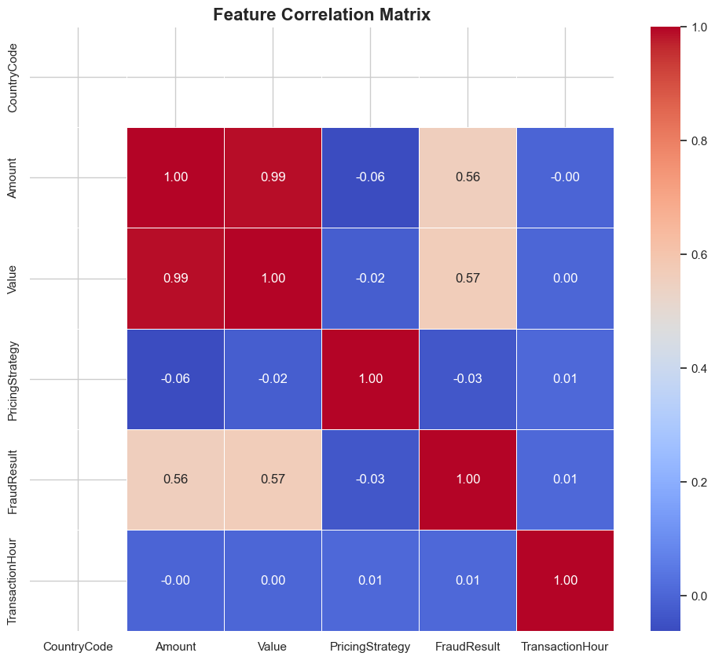
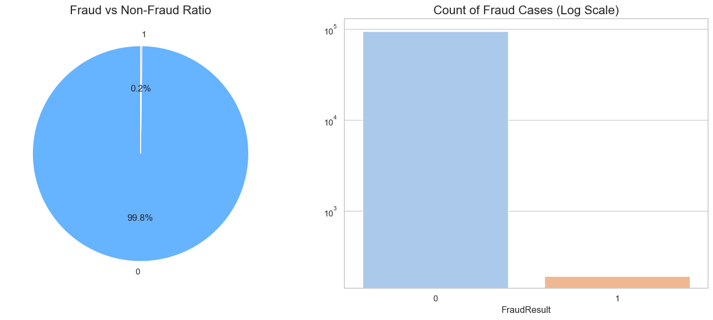


<div align="center">

# 🛡️ Credit Risk Engine: Alternative Data Analytics
### Precision Scoring for the Unbanked via Behavioral Proxies


<p align="center">
  <b>Ingest</b> • <b>Cluster</b> • <b>Train</b> • <b>Serve</b>
</p>

</div>

---

## 1. 📖 Project Overview

### The Challenge: The "Cold Start" in Credit
Traditional credit scoring relies on historical debt repayment data. In emerging markets and the **Buy-Now-Pay-Later (BNPL)** sector, millions of potential customers are **"credit invisible"**—they lack formal credit history but possess rich transactional footprints. Denying them service is a missed opportunity; validating them without data is a financial risk.

### The Solution: Behavioral Proxy Modeling
This project delivers an **end-to-end Machine Learning System** that constructs a creditworthiness score from *alternative data*. By analyzing **Recency, Frequency, and Monetary (RFM)** patterns, we mathematically infer reliability, transforming raw transaction logs into actionable risk probabilities.

**System Capabilities:**
*   **Behavioral Profiling**: Aggregates millisecond-level transaction logs into customer prototypes.
*   **Unsupervised Labeling**: Uses **K-Means Clustering** to generate "Good/Bad" ground truth labels.
*   **Audit-Ready Models**: Deploys interpretable **Logistic Regression** and high-performance **Gradient Boosting**.
*   **MLOps Architecture**: Fully automated training pipeline with **MLflow** tracking and **FastAPI** serving.

### 📂 Repository Structure
```bash
.
├── 🚀 api/                 # Production-grade FastAPI endpoints
│   ├── main.py
│   └── schemas.py          # Strict Pydantic validation
├── 📊 dashboard/           # Graphical EDA outputs
├── 💾 data/                # Data Lake (Raw & Processed)
├── 🐳 docker/              # Containerization assets
├── 🧠 src/                 # Core Logic
│   ├── features.py         # RFM & WoE Feature Store
│   ├── train.py            # Pipeline Training & Registry
│   └── predict.py          # Inference Engine
├── 🧪 tests/               # Pytest Suite
└── 📑 final_report.md      # Detailed technical documentation
```

---

## 2. 🏦 Credit Scoring Business Understanding

### a) Basel II Accord Discussion
The **Basel II Capital Accord** establishes rigorous standards for risk management, requiring banks to hold capital reserves proportional to their credit risk exposure. This project adheres to the **Internal Ratings-Based (IRB)** approach:
*   **Risk Measurement**: We calculate **Information Value (IV)** and **Weight of Evidence (WoE)** to strictly validate the predictive power of every feature.
*   **Drivable Interpretability**: Our use of **Logistic Regression** ensures that every decision can be decomposed into feature coefficients, satisfying the requirement for **Auditable AI**.

### b) Proxy Variable Justification
**Problem:** *How do you train a supervised model without historical default labels?*
**Hypothesis:** *Financial discipline is habitual.*
We utilize **RFM Analysis** as a proxy:
*   **Recency (R)**: Dormancy indicates churn/risk.
*   **Frequency (F)**: Consistency indicates reliability.
*   **Monetary (M)**: Volume indicates capacity.
> We cluster users based on these vectors. The cohort with **High Recency and Low Frequency** is mathematically defined as "High Risk".

**Risk Advisory**:
*   *Misclassification*: A frugal user (Low F, Low M) may be flagged as risky.
*   *Bias*: The model favors high-velocity transactors.

### c) Model Trade-offs in Regulated Finance

| Feature | Logistic Regression | Gradient Boosting (GBM) |
| :--- | :--- | :--- |
| **Philosophy** | "White Box" | "Black Box" |
| **Interpretability** | **High** (Native Coefficients) | **Low** (Requires SHAP) |
| **Performance** | Linear Boundaries | Non-Linear Complexities |
| **Regulatory Fit** | **Optimal** | **Challenger Only** |

**Strategic Decision**: We deploy a pipeline capable of serving both, prioritizing Logistic Regression for regulatory sandbox environments and GBM for internal risk ranking.

---

## 3. 🏗️ Technical Architecture

### ⚙️ Feature Engineering Pipeline
Data flows through a **Scikit-Learn Pipeline**:
1.  **Temporal Extraction**: Decomposing timestamps into `Hour`, `Day`, `Month` to capture seasonality.
2.  **RFM Aggregation**: Summarizing user history.
3.  **Categorical Encoding**: One-Hot Encoding channel identifiers (`ChannelId`).
4.  **Scaling**: Standardizing all inputs via `StandardScaler`.

### 🎯 Proxy Target Creation
We employ **K-Means Clustering ($k=3$)**:
*   **Cluster 0**: High-Value, Active (Low Risk)
*   **Cluster 1**: Mid-Tier (Low Risk)
*   **Cluster 2**: Dormant/Churned (High Risk -> Target = 1)

### 🔁 MLOps & Deployment
*   **Training**: GridSearch optimizes hyperparameters ($C$, $n\_estimators$).
*   **Tracking**: **MLflow** logs every experiment, metric ($AUC$, $F1$), and artifact.
*   **Serving**: A containerized **FastAPI** service loads the production model from the MLflow registry.
*   **CI/CD**: GitHub Actions enforces code quality (`flake8`) and logic validity (`pytest`).

---

## 4. 🔗 Dataset Sources

> **Transparency Note**: The datasets utilized in this project are hosted externally to maintain repository leanness and distinct data governance.

**Primary Transaction Logs & Meta-Data:**
*   📥 **[Xente_Variable_Definitions.csv](https://drive.google.com/file/d/1w0qmcZxiG006CFIZ1_JPkkg0JFk7jbyq/view?usp=sharing)**
*   📥 **[training.csv](https://drive.google.com/file/d/1JBKwE_-Nk9aHCBx2zQgbvQR_pMCz6xG6/view?usp=sharing)**

**Integration Strategy**:
The `src/data_processing.py` module is designed to accept local paths. Download these files to `data/raw/` to trigger the pipeline.

---

## 5. 📈 Dashboard & Visual Outputs

### Transaction Volume Analysis
<div align="center">
  
  <br>
  <i>Fig 1: Temporal analysis revealing cyclical transaction peaks.</i>
</div>

### Feature Correlation Matrix
<div align="center">
  
  <br>
  <i>Fig 2: Heatmap confirming the strong collinearity between Frequency and Monetary value.</i>
</div>

### Fraud Distribution
<div align="center">
  
  <br>
  <i>Fig 3: Channel-specific risk concentration.</i>
</div>

---

## 6. 👨‍💻 Author

**Mifta Y**
*   **LinkedIn**: [Connect Profile](https://www.linkedin.com/in/miftah-ebrahim-b422b3364/)
*   **Telegram**: `Miftah_deva`

---

<p align="center">
  <i>Built for the Future of Finance.</i>
</p>
